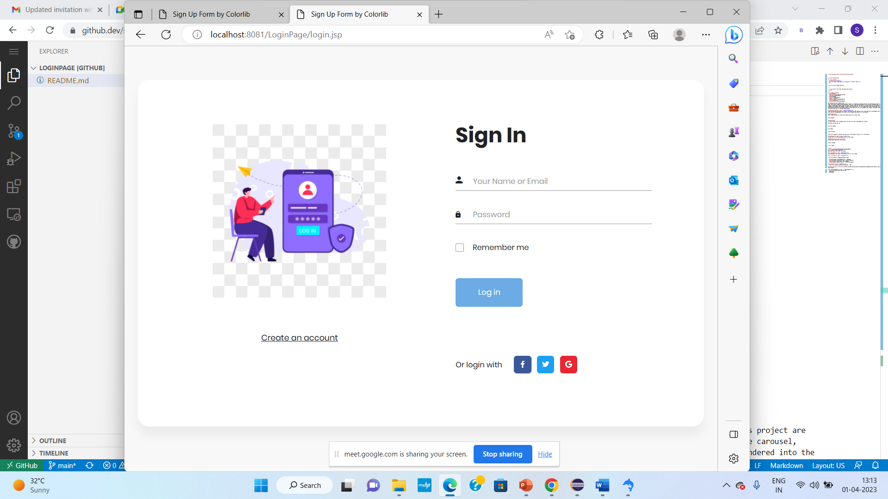

# Login And Registration using Servelets,JSP And MySql


# project-documentation

<p align="center">
  <a href="" rel="noopener">
 </a>
</p>


<h3 align="center">LoginPage</h3>

---

<p align="center"> Few lines describing your project.
    <br> 
</p>

## 📝 Table of Contents
- [About](#about)
- [Getting Started](#getting_started)
- [Deployment](#deployment)
- [Usage](#usage)
- [Flow Chart](#flowchart)
- [TODO](../TODO.md)
- [Contributing](../CONTRIBUTING.md)
- [Authors](#authors)
- [Acknowledgments](#acknowledgement)

## 🧐 About <a name = "about"></a>
Fully Functional E-commerce website LoginPage is a responsive e-commerce website. The technologies used in this project are HTML,JSP,Servlets, CSS, java wsing JavaScript and Bootstrap. There are a few important modules in the project like Signin page, image carousel, Create an account, wishlist page etc. The data is accessed using ajax call and then rendered into the webpage using dynamic html template created using Servlet. For Login-page we are using Jsp to  data before clicking on the checkout button. SkillLync helped me by providing the Spring-frames for all relevant feature pages

## 🏁 Getting Started <a name = "getting_started"></a>
These instructions will get you a copy of the project up and running on your local machine for development and Login. See [deployment](#deployment) for notes on how to deploy the project on a live system.

### Prerequisites
What things you need to install the software and how to install them.

```
we have install Eclips,Spring boot,mysql,jsp
```

### Installing
A step by step series of examples that tell you how to get a development env running.

Say what the step will be

https://start.spring.io/
https://mysql.com/downloads/mysql/
https://www.eclipse.org/downloads/download.php?file=/oomph/epp/2023-03/R/eclipse-inst-jre-win64.exe


```
Give the example
```

And repeat

```
until finished
```

End with an example of getting some data out of the system or using it for a little demo.

## 🔧 Running the tests <a name = "tests"></a>
Explain how to run the automated tests for this system.

### Break down into end to end tests
Explain what these tests test and why
End-to-end tests are designed to test the complete flow of the application from the Account's perspective so it's important to think about the different Account holder actions and interactions that need to be tested
```
Give an example
```

<<<<<<< HEAD


=======
>>>>>>> ccb3ef98e38119bc8d4d95dd9750ea018ced0479
## 🎈 Usage <a name="usage"></a>
Add notes about how to use the system.
1. Installation: Need to install all the supporting dependencies as mentioned in installing topic.

2. Configuration: Configure the database connection by modifying application.properties with  database information.

3. Usage instructions: Start the back end server, then start the front end using Eclips java spring boot, give the login access using jsp. After successful login, we can create the Account using images and Activity.

4. Limitations: As it is Login Page, users can able to create Account  when using the application. This can include known bugs or issues, performance limitations, or any specific use cases that the application or library may not support.


5. Troubleshooting: Before starting the Back-end server, user can't start from the client side. It will throw axios: NetworkError.


## 🚀 Deployment <a name = "deployment"></a>
To deploy the application to a production environment, follow these steps:

1. Ensure that you have installed the required dependencies and have configured the necessary environment variables, such as the database connection details and any API keys.

2. Start the application by running "java application" from Run As for the backend.

3. Copy the built application to the server or hosting environment where you want to deploy the application.

4. Start the application.

5. Application is accessible from the internet by configuring http://loclhost:3000 and http://localhost:8080/api/v1/login.

6. Monitor the application for any errors or issues, and make any necessary updates or patches as needed.


## ⛏️ Flow Chart <a name = "flowchart"></a>


-- [MySQL](https://mysql.com/) - Database
- [Express](https://expressjs.com/) - Server Framework
- [NextJs](https://nextjs.org/) - Web Framework
- [Eclipse](https://www.eclipse.org/) - Server Environment

## ✍️ Authors <a name = "authors"></a>
- [@SkillLymc](https://github.com/kylelobo) - FSD

See also the list of [contributors](https://github.com/kylelobo/The-Documentation-Compendium/contributors) who participated in this project.
The team at Skill-Lync, for generously providing the data used in this project.

## 🎉 Acknowledgements <a name = "acknowledgement"></a>
I would like to thank the following individuals for their contributions to this project:


